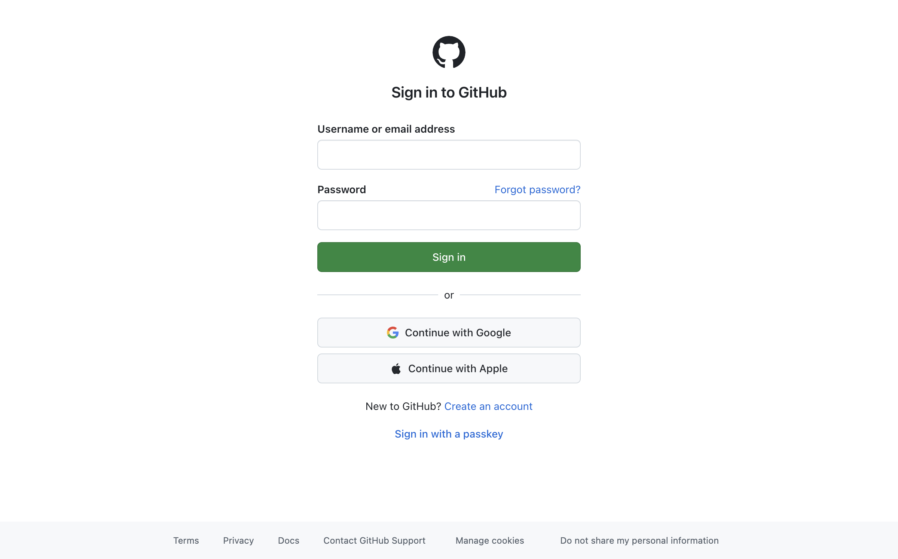

# browser-py

Lightweight Python library and CLI to control Chrome/Chromium via [CDP](https://chromedevtools.github.io/devtools-protocol/) (Chrome DevTools Protocol).

**The killer feature:** connects to your **existing browser sessions** — all your logins, cookies, and extensions carry over. Log in once, automate forever.

```bash
pip install browser-py
```

---

## Getting Started

### Step 1: Launch the browser

```bash
browser-py launch
```

```
✓ Chrome launched on port 9222
  Profile: ~/.browser-py/profile

⚡ First launch — a fresh Chrome window opened.
   Log into the sites you want to automate (Gmail, GitHub, etc.).
   Those sessions will persist for all future launches.
```

**What happens:** browser-py starts a Chrome instance with its own profile directory (`~/.browser-py/profile`). This is separate from your regular Chrome — it won't interfere with your daily browsing.

> **First time only:** A fresh Chrome window opens. Log into the websites you want to automate — GitHub, Gmail, Reddit, whatever. Close the window when done. Your sessions are saved in the profile directory.

### Step 2: Launch again (sessions persist)

```bash
browser-py launch
```

```
✓ Chrome launched on port 9222
  Profile: ~/.browser-py/profile

Ready — your saved sessions are active.
Try: browser-py tabs
```

**Everything you logged into last time is still there.** No re-authentication needed. The profile directory keeps your cookies, localStorage, and session data across restarts.

### Step 3: Control it

Open a second terminal (keep the browser running):

```bash
browser-py open github.com
```

```
Navigated to https://github.com
💡 Run 'elements' to see interactive elements on this page.
```

That's it. Three commands to go from zero to browser automation.

---

## Tutorial: Your First Automation

Let's walk through a real example — browsing Hacker News.

### See what's clickable

```bash
browser-py elements
```

```
[0] (link) Hacker News → https://news.ycombinator.com/news
[1] (link) new → https://news.ycombinator.com/newest
[2] (link) past → https://news.ycombinator.com/front
[3] (link) comments → https://news.ycombinator.com/newcomments
[4] (link) ask → https://news.ycombinator.com/ask
[5] (link) show → https://news.ycombinator.com/show
[6] (link) jobs → https://news.ycombinator.com/jobs
[7] (link) submit → https://news.ycombinator.com/submit
[8] (link) login → https://news.ycombinator.com/login?goto=news
[9] (link) Sizing chaos → https://pudding.cool/2026/02/womens-sizing/
...

💡 226 elements found. Use 'click <number>' or 'type <number> <text>' to interact.
```

Every interactive element gets a number. Links, buttons, inputs, dropdowns — anything you can click or type into.

### Click something

```bash
browser-py click 9
```

```
Clicked: (a) Sizing chaos
```

The browser navigates to that link, just like clicking it with your mouse.

### Read the page

```bash
browser-py text
```

```
Sizing chaos — An investigation into women's clothing sizes...
```

Extracts all visible text (up to 8KB). Useful for scraping or checking what loaded.

### Go back and try a form

```bash
browser-py back
browser-py open https://github.com/login
browser-py elements
```

```
[0] (link) Skip to content
[1] (input:text) login
[2] (input:password) password
[3] (link) Forgot password?
[4] (input:submit) commit [Sign in]
[5] (button) Continue with Google
...
```

### Type into inputs

```bash
browser-py type 1 "myusername"
browser-py type 2 "mypassword"
browser-py click 4
```

```
Typed into [1] (input)
Typed into [2] (input)
Clicked: (input) Sign in
```

### Take a screenshot

```bash
browser-py screenshot result.png
```

```
Screenshot saved: result.png
```

<p align="center">
  
  <br>
  <em>Screenshot captured via browser-py</em>
</p>

---

## How It Works

### The connection

```
┌─────────────┐     CDP (WebSocket)     ┌──────────────────┐
│  browser-py  │ ◄──────────────────────► │  Chrome/Chromium  │
│  (your code) │     localhost:9222       │  (your sessions)  │
└─────────────┘                          └──────────────────┘
```

`browser-py launch` starts Chrome with `--remote-debugging-port=9222` and a persistent `--user-data-dir`. All browser-py commands connect to that port via WebSocket. Your sessions live in the user-data-dir and survive restarts.

### The element index

When you run `elements`, browser-py injects JavaScript that:

1. Scans the entire DOM for interactive elements (links, buttons, inputs, etc.)
2. **Pierces shadow DOM** — works on Reddit, GitHub, and other sites using web components
3. Numbers each element and stores the index as a `data-bpy-idx` attribute
4. De-duplicates and prioritizes modal/dialog elements

Then `click 3` or `type 5 hello` targets that exact element.

### Real mouse events

`click` doesn't just call `.click()` in JavaScript. It uses CDP's `Input.dispatchMouseEvent` to simulate real mouse presses. This matters because:

- React, Vue, and Angular use synthetic event systems that can ignore `.click()`
- Some sites only respond to mousedown → mouseup sequences
- Hover states and focus behavior work correctly

### Framework-aware typing

`type` dispatches proper `input` and `change` events using React's native value setter (`Object.getOwnPropertyDescriptor(HTMLInputElement.prototype, 'value').set`). This means SPAs that manage state through controlled components get the value update correctly.

---

## Using as a Python Library

```python
from browser_py import Browser

# Launch Chrome (first time — or skip if already running)
Browser.launch()

# Connect and use
b = Browser()
b.open("https://github.com")

# List interactive elements
elements = b.elements()
for el in elements[:5]:
    print(el)
# [0] (link) Home → /
# [1] (button) Sign In
# [2] (input:text) Search
# ...

# Interact by index
b.click(1)                    # Click element [1]
b.type(2, "search query")     # Type into element [2]

# Read content
text = b.text()               # Visible text (max 8KB)
html = b.html("nav")          # outerHTML of a specific element
title = b.eval("document.title")  # Run any JavaScript

# Screenshot
b.screenshot("page.png")

# File upload (bypasses OS dialog)
b.upload("~/photos/avatar.jpg")
```

### Scoped element queries

```python
# Only elements inside a specific container
b.elements(".sidebar")
b.elements("#modal-dialog")
b.elements("form.login")
```

### Tab management

```python
tabs = b.tabs()                # List all tabs
b.tab(2)                       # Switch to tab [2]
b.newtab("https://gmail.com")  # Open new tab
b.close_tab(0)                 # Close tab [0]
```

### Navigation

```python
b.open("https://example.com")
print(b.url())                 # Current URL
b.back()                       # Browser back
b.forward()                    # Browser forward
b.refresh()                    # Reload
b.scroll("down", 1000)         # Scroll down 1000px
b.scroll("top")                # Scroll to top
```

### Low-level CDP access

For anything browser-py doesn't have a method for:

```python
from browser_py import Browser, CDPSession

b = Browser()
target = b._current_target()

# Raw CDP protocol commands
cdp = CDPSession.connect_to_page(target["id"], port=9222)
result = cdp.send("Runtime.evaluate", expression="document.title")
print(result)
# {'result': {'type': 'string', 'value': 'GitHub'}}

# Network interception, cookie manipulation, device emulation —
# anything in the CDP spec: https://chromedevtools.github.io/devtools-protocol/
cdp.close()
```

---

## CLI Reference

### Setup
| Command | Description |
|---------|-------------|
| `launch [--port N] [--headless] [--user-data-dir PATH]` | Start Chrome with remote debugging |

### Navigation
| Command | Description |
|---------|-------------|
| `open <url>` | Navigate to URL (adds https:// if missing) |
| `url` | Print current URL |
| `back` | Go back in history |
| `forward` | Go forward in history |
| `refresh` | Reload page |

### Tabs
| Command | Description |
|---------|-------------|
| `tabs` | List open tabs with index, title, URL |
| `tab <index>` | Switch to tab by index |
| `newtab [url]` | Open new tab |
| `close [index]` | Close tab (default: current) |

### Interact
| Command | Description |
|---------|-------------|
| `elements [selector]` | List interactive elements (numbered) |
| `click <index>` | Click element by number |
| `type <index> <text>` | Type into input element |
| `upload <path> [selector]` | Upload file to file input |

### Read
| Command | Description |
|---------|-------------|
| `text [selector]` | Extract visible text (max 8KB) |
| `html <selector>` | Get outerHTML (max 10KB) |
| `eval <js>` | Run JavaScript, print result |
| `screenshot [path]` | Save PNG screenshot |

### Other
| Command | Description |
|---------|-------------|
| `scroll <up\|down\|top\|bottom> [px]` | Scroll the page |
| `wait <ms>` | Wait (useful in scripts) |

Every command has `--help`:

```bash
browser-py click --help
browser-py elements --help
```

---

## Environment Variables

| Variable | Description | Default |
|----------|-------------|---------|
| `CDP_URL` | CDP endpoint URL | `http://127.0.0.1:9222` |
| `NO_COLOR` | Disable colored CLI output | (unset) |

Override the port without changing code:

```bash
export CDP_URL=http://127.0.0.1:9333
browser-py tabs
```

---

## Launch Options

```bash
# Default — port 9222, profile at ~/.browser-py/profile
browser-py launch

# Custom port
browser-py launch --port 9333

# Custom profile location
browser-py launch --user-data-dir ~/my-automation-profile

# Headless mode (no visible window — for servers and CI)
browser-py launch --headless

# Specific Chrome/Chromium binary
browser-py launch --chrome /usr/bin/chromium
```

### Multiple profiles

Run different automation tasks with separate sessions:

```bash
# Profile for work
browser-py launch --port 9222 --user-data-dir ~/.browser-py/work

# Profile for personal
browser-py launch --port 9333 --user-data-dir ~/.browser-py/personal

# Connect to each
CDP_URL=http://127.0.0.1:9222 browser-py tabs   # work
CDP_URL=http://127.0.0.1:9333 browser-py tabs   # personal
```

---

## Shadow DOM Support

browser-py automatically pierces shadow DOM boundaries. Sites using web components — Reddit, GitHub, Salesforce, Angular Material, Shoelace, etc. — work out of the box.

```bash
# Reddit uses shadow DOM extensively — no problem
browser-py open reddit.com
browser-py elements        # Finds elements inside shadow roots
browser-py click 5         # Clicks them normally
```

No special flags, no configuration. The element scanner recursively enters every shadow root on the page.

---

## FAQ

**Q: Can I use my main Chrome profile?**
Only if Chrome isn't already running. Chrome locks its profile directory — one instance at a time. Since most people keep Chrome open, `browser-py launch` creates a separate profile. This is intentional — it keeps your automation isolated from your daily browsing.

**Q: Do I need to log in every time?**
No. Log in once during your first `browser-py launch`. The profile directory persists your sessions. Future launches reuse them.

**Q: What about 2FA?**
Same as regular Chrome — complete the 2FA flow once in the browser-py Chrome window. Most sites remember the device via cookies, so you won't be asked again.

**Q: Does it work headless (no display)?**
Yes. `browser-py launch --headless` runs Chrome without a visible window. Works on servers and CI. You'll need to log in with a visible window first to set up sessions, then switch to headless.

**Q: What browsers are supported?**
Chrome, Chromium, Brave, Microsoft Edge — anything Chromium-based with CDP support. Firefox is not supported (different protocol).

**Q: How is this different from Selenium/Playwright?**
| | browser-py | Selenium | Playwright |
|---|:---:|:---:|:---:|
| Session reuse | ✅ | ❌ | Partial |
| Dependencies | 1 (websockets) | Heavy | Heavy |
| Shadow DOM | ✅ | ❌ | ❌ |
| Install size | ~100KB | ~50MB | ~200MB+ |
| Browser download | No | Yes | Yes |

---

## Scripting Example

Automate a multi-step flow:

```python
from browser_py import Browser
import time

b = Browser()

# Login to a site (sessions persist — only needed once)
b.open("https://myapp.com/login")
b.type(0, "user@example.com")      # Email field
b.type(1, "password123")            # Password field
b.click(2)                          # Submit button
time.sleep(2)                       # Wait for redirect

# Now do something useful
b.open("https://myapp.com/dashboard")
elements = b.elements()

# Find and click a specific button
for el in elements:
    if "Export" in el.desc:
        b.click(el.index)
        break

b.screenshot("dashboard.png")
```

---

## License

MIT
