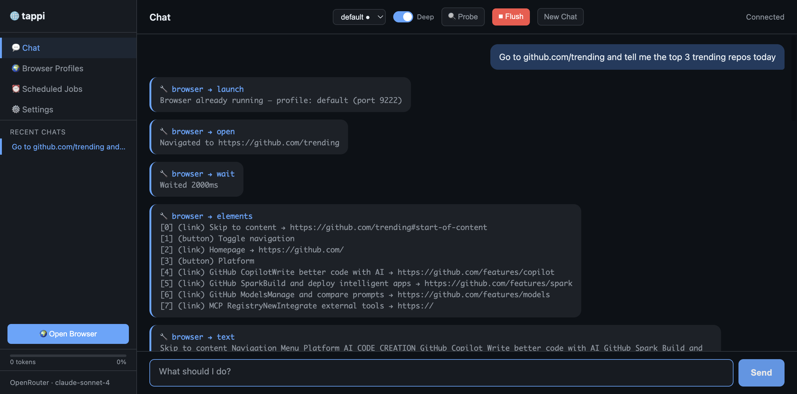
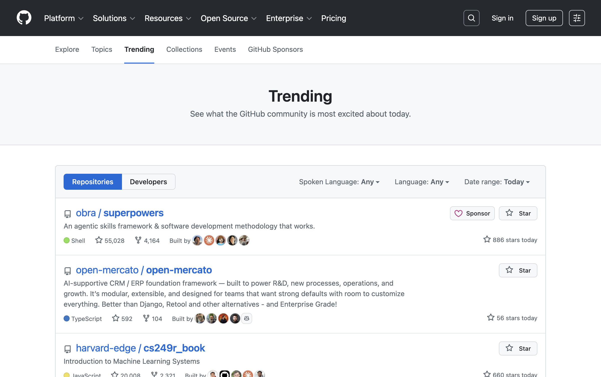
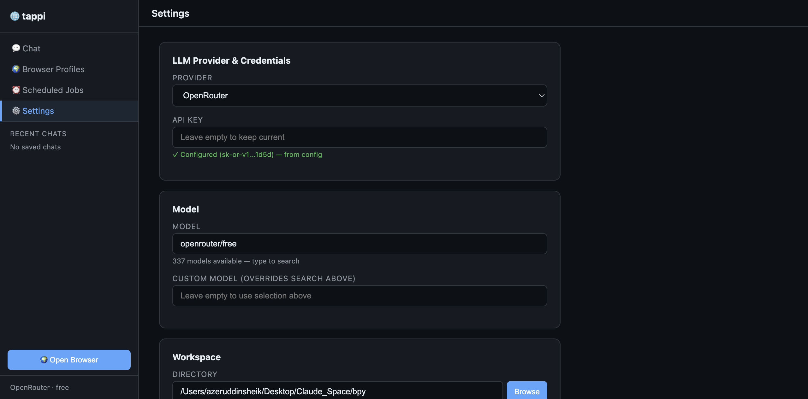
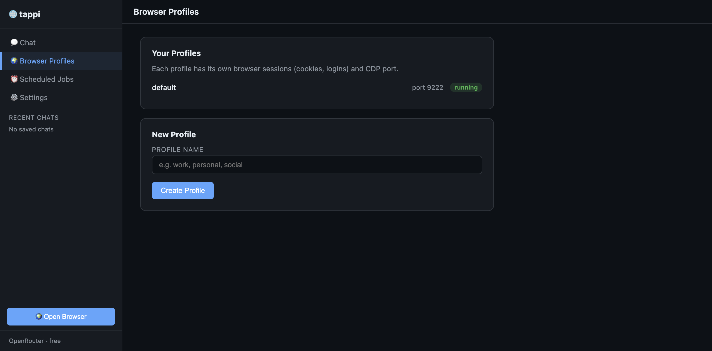
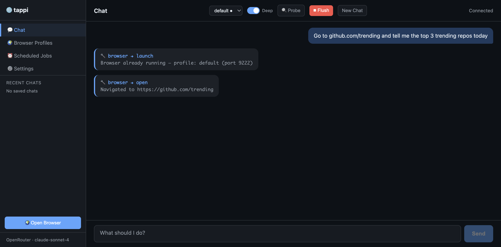
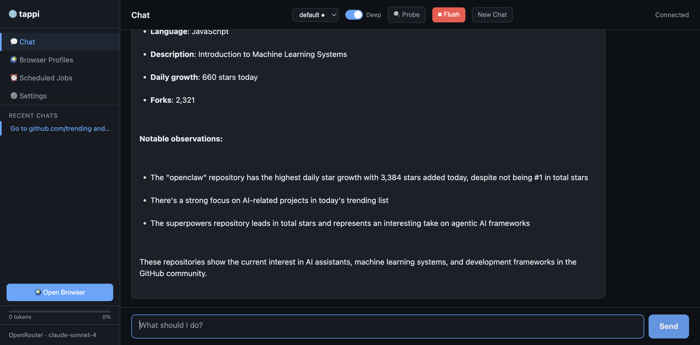
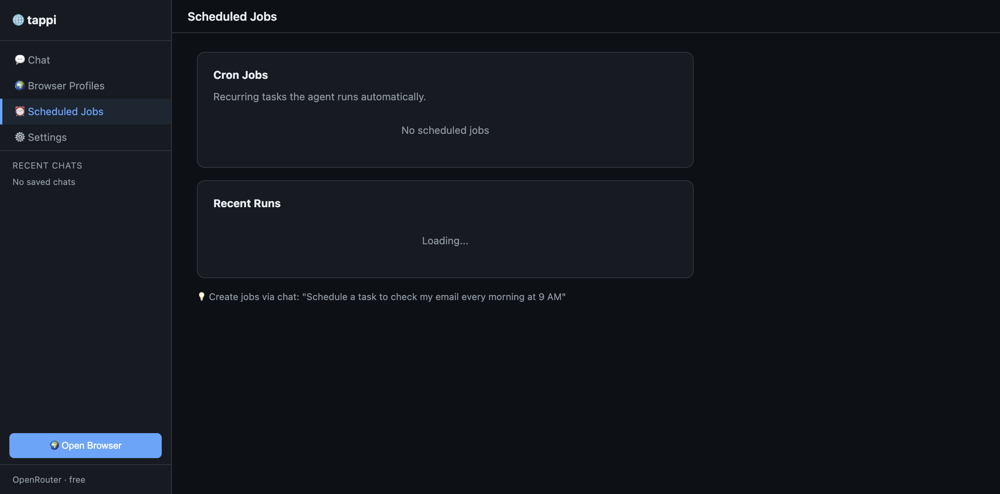

# Tappi: Your Browser on Autopilot — Without the Token Tax

*A local, token-efficient AI agent that controls your real browser. No APIs. No bans. No screenshots-as-input madness.*

---

## The Problem Nobody Talks About

Every AI browser agent today does one of two things: send a full screenshot to the LLM, or dump the entire DOM tree. Sometimes both.

Screenshots mean the LLM is doing **vision work** — squinting at pixels, guessing coordinates, praying it clicks the right button. A single interaction can burn thousands of tokens on image analysis alone.

DOM dumps are even worse. A modern webpage's DOM is enormous — tens of thousands of tokens of nested divs, classes, aria attributes, and scripts. The LLM has to **reason through all of it** just to figure out which element to interact with. That's not automation. That's an LLM doing a reading comprehension exam on every single click.

OpenAI's Operator, Anthropic's Computer Use, even most open-source browser agents — they all pay this tax. The LLM spends more time *figuring out what's on the page* than actually doing your task. Scale that to any real workflow and you're hemorrhaging tokens while the agent overthinks where to click.

## What Tappi Does Differently

Tappi doesn't send screenshots. It indexes every interactive element on the page into a compact numbered list:

```
[0] (link) Skip to content
[1] (button) Toggle navigation
[2] (link) Homepage → https://github.com/
[3] (button) Platform
[4] (link) GitHub Copilot — Write better code with AI
[5] (link) GitHub Spark — Build and deploy intelligent apps
```

The LLM sees this and says `click 4`. Done. No pixel parsing. No coordinate guessing. No hallucinated CSS selectors.

**The result:** 10x fewer tokens per interaction. The LLM reasons less and acts faster. You can visibly see the difference — where other agents pause and deliberate on every click, Tappi fires through actions at machine speed.

Here's a real session — the agent browsing GitHub Trending, showing every tool call:


*The numbered element list is what the LLM actually sees — not a 1MB screenshot.*

And here's what Tappi's browser was looking at:



## Why Local Matters

"Just use an API." "Just use a scraping service."

Sure — if you want to:
- Get rate-limited or banned from platforms
- Pay per request for data you could get for free
- Lose access to anything behind a login

Tappi runs on **your machine**, in **your browser**, with **your saved sessions**. Log into Gmail, Twitter, LinkedIn, Instagram once — and Tappi can work with all of them forever. No re-authentication. No CAPTCHAs. No proxy rotation.

Because it's doing the same thing you'd do manually — just faster and in the background — **there's zero ban risk.** You're not scraping. You're browsing.

And your data never leaves your machine. No cloud. No third-party servers.

## Who Is This For?

**Anyone who uses a browser.** That's not a cop-out — it's the point.

- **Social media managers** — Schedule posts, reply to comments, monitor engagement
- **Researchers** — Scrape data, compile reports, track competitors. Output straight to PDF or Excel
- **Founders** — Automate outreach, monitor mentions, pull analytics
- **Developers** — Test flows, scrape docs, automate repetitive dev tasks
- **Anyone drowning in tabs** — Hand off the busywork. Keep the thinking.

## Sandboxed by Design

Most AI agent platforms have access to your filesystem, your shell, your everything. That's powerful — but it's a lot of trust.

Tappi is deliberately limited:
- **One browser.** One workspace directory. That's the blast radius.
- No filesystem access beyond the folder you define
- No shell access unless you explicitly enable it

If your work is browser + files (and for most people, it is), Tappi gives you everything you need without exposing your system.

## Features at a Glance

| Feature | Details |
|---------|---------|
| 🌐 **Browser Control** | Navigate, click, type, scroll, screenshot, tab management |
| 📁 **File Management** | Read, write, move, copy — sandboxed to workspace |
| 📄 **PDF** | Read existing PDFs, create new ones from HTML |
| 📊 **Spreadsheets** | Read/write CSV and Excel (.xlsx) |
| ⏰ **Cron Jobs** | Schedule recurring tasks with cron expressions |
| 💻 **Shell** | Optional — run commands within workspace |
| 🖥️ **Web UI** | Chat interface with live tool-call visibility |
| 🤖 **Multi-Provider** | OpenRouter, Anthropic, OpenAI, Claude Max (OAuth), Bedrock, Azure, Vertex |
| 🔍 **Shadow DOM** | Pierces Shadow DOM (Reddit, GitHub, etc.) |
| 👤 **Profiles** | Multiple browser profiles — work, personal, social |

---

## Getting Started

### 1. Install

```bash
pip install tappi[agent]
```

Requirements: Python 3.10+, Chrome or Chromium. Works on Linux, macOS, Windows.

### 2. Setup

```bash
bpy setup
```

The wizard walks you through provider, API key, workspace, and browser profile:


*Settings are also configurable via the Web UI.*

**Pro tip:** If you have a Claude Pro/Max subscription ($20-200/mo), use your OAuth token — the same one Claude Code uses. No per-call API charges.

### 3. Launch Your Browser

```bash
bpy launch
```

First launch opens a fresh Chrome window. **Log into the sites you want to automate** — Gmail, GitHub, social media. Those sessions persist for all future launches.


*Create separate profiles for work, personal, and social media.*

### 4. Give It a Task

**CLI — one-shot:**
```bash
bpy agent "Go to Hacker News and summarize the top 5 posts into a PDF"
```

**CLI — interactive:**
```bash
bpy agent
```

**Web UI:**
```bash
bpy serve
```


Here's what a real session looks like. I asked: *"Go to github.com/trending and tell me the top 3 trending repos today"*

The agent launched the browser, navigated to the page, indexed all elements, extracted the text, and reported back:


*Each tool call is visible in real-time as the agent works.*


*Final result with structured analysis.*

### 5. Schedule Recurring Tasks

```
You: Every morning at 9 AM, check trending repos on GitHub 
     and save the top 10 to trending.csv

Agent: Done. Created job "GitHub Trends" — runs daily at 09:00.
```


*Jobs persist and run automatically when the server is active.*

---

## The Architecture

```
    You (CLI or Web UI)
         ↓
    ┌─────────────┐
    │  LLM Agent  │ ← Sees 6 tools as JSON schemas
    └──────┬──────┘
           │
    ┌──────┴──────┐
    │  Tool Calls │
    ├─────────────┤
    │ 🌐 Browser  │ → CDP → Your Chrome (with all your sessions)
    │ 📁 Files    │ → Sandboxed workspace directory
    │ 📄 PDF      │ → Read/create PDFs
    │ 📊 Sheets   │ → CSV/Excel
    │ 💻 Shell    │ → Optional, workspace-only
    │ ⏰ Cron     │ → Scheduled recurring tasks
    └─────────────┘
```

No middleware. No cloud. No screenshots. Just structured element data flowing between your browser and your LLM.

---

## CLI Quick Reference

```bash
# Agent
bpy setup                     # Configure provider, workspace, browser
bpy agent [message]           # Chat (interactive or one-shot)
bpy serve                     # Start the Web UI

# Browser
bpy launch                    # Start Chrome
bpy open <url>                # Navigate
bpy elements                  # List clickable elements (numbered)
bpy click <n>                 # Click element by number
bpy type <n> <text>           # Type into element
bpy text                      # Extract visible text
bpy screenshot [path]         # Save screenshot
bpy tabs                      # List open tabs
```

---

## Links

- **GitHub:** [github.com/shaihazher/tappi](https://github.com/shaihazher/tappi)
- **PyPI:** [pypi.org/project/tappi](https://pypi.org/project/tappi)

```bash
pip install tappi[agent]
bpy setup
bpy agent "Check my Gmail for unread emails and summarize them"
```

Three commands. That's it. It opens your Chrome, uses your saved login, reads your inbox, and reports back.

---

*Built by [Azeruddin Sheik](https://github.com/shaihazher). Tappi started as an internal tool for browser automation — then it got efficient enough to stand on its own.*
