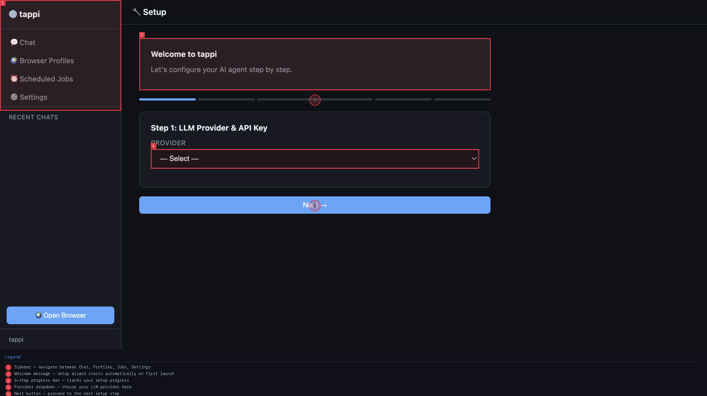
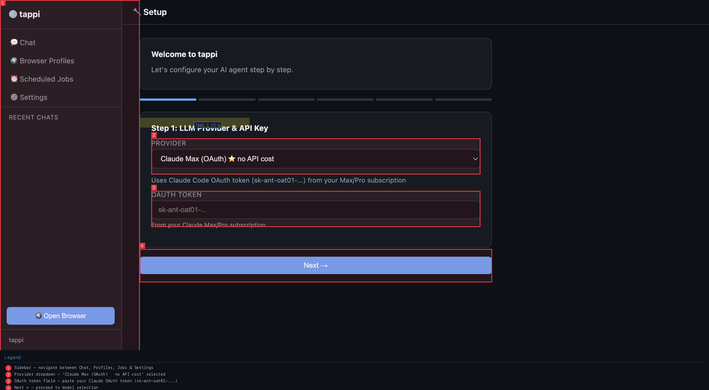
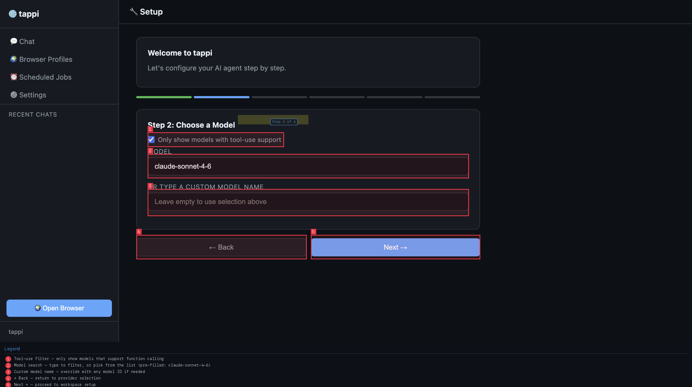
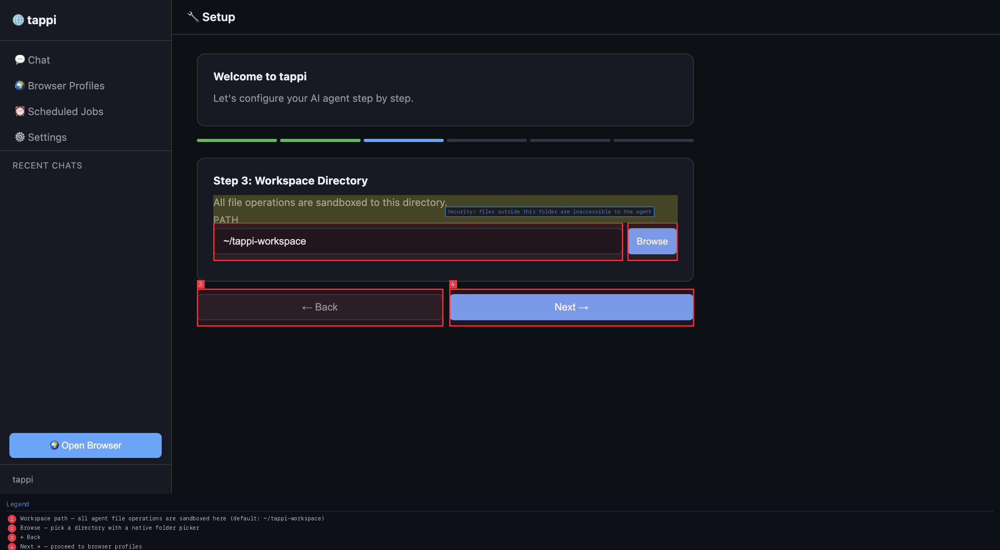
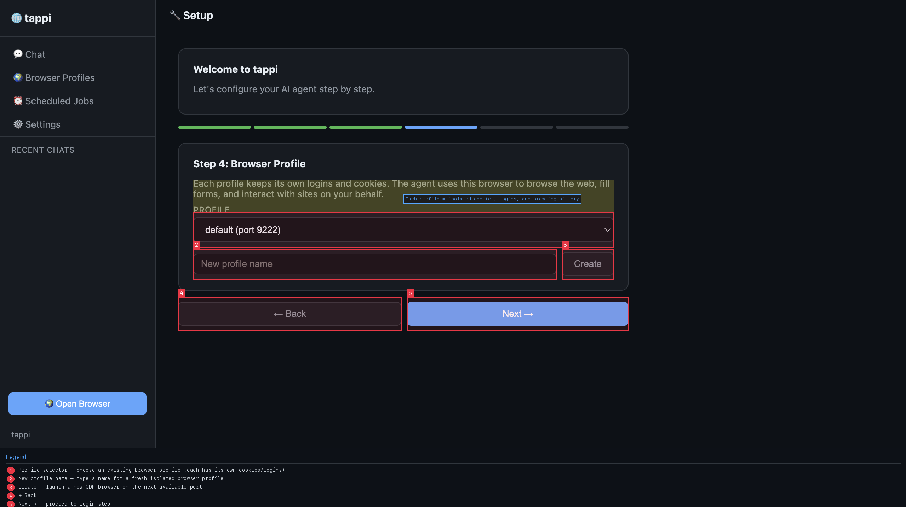
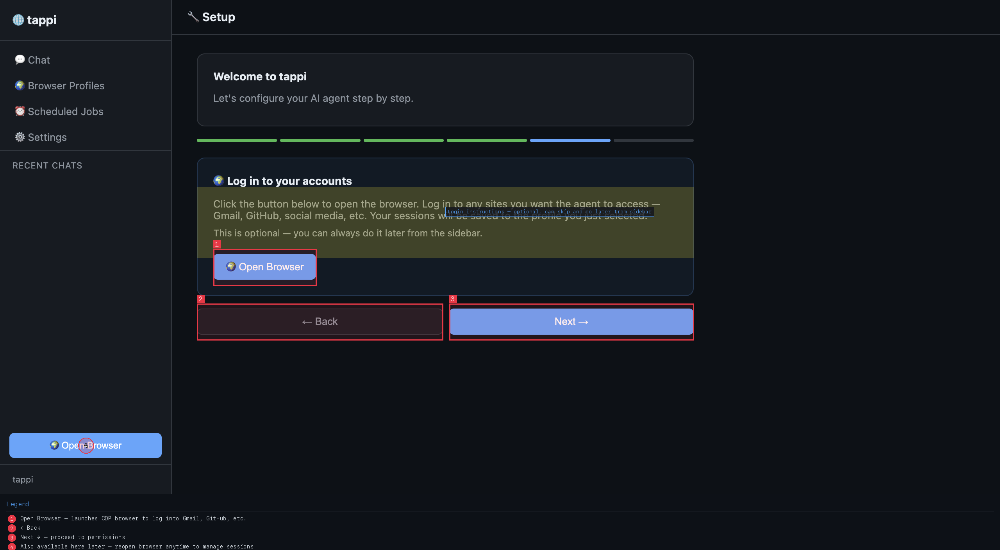
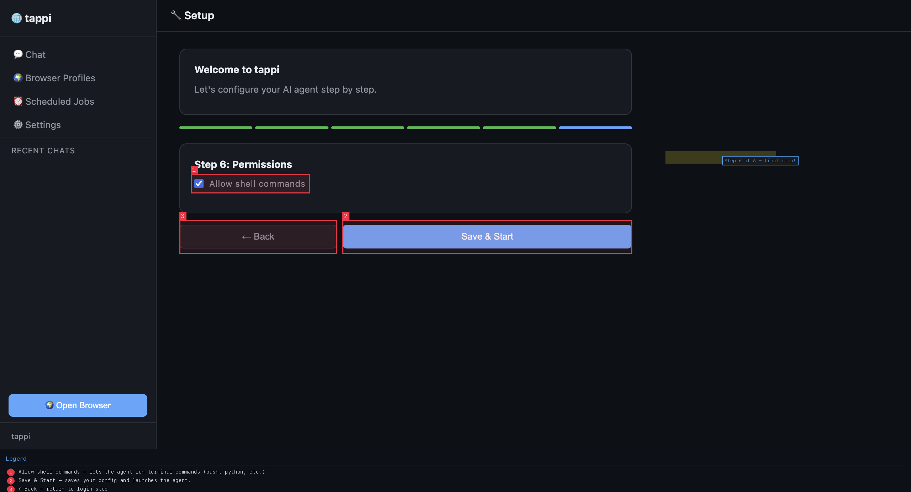
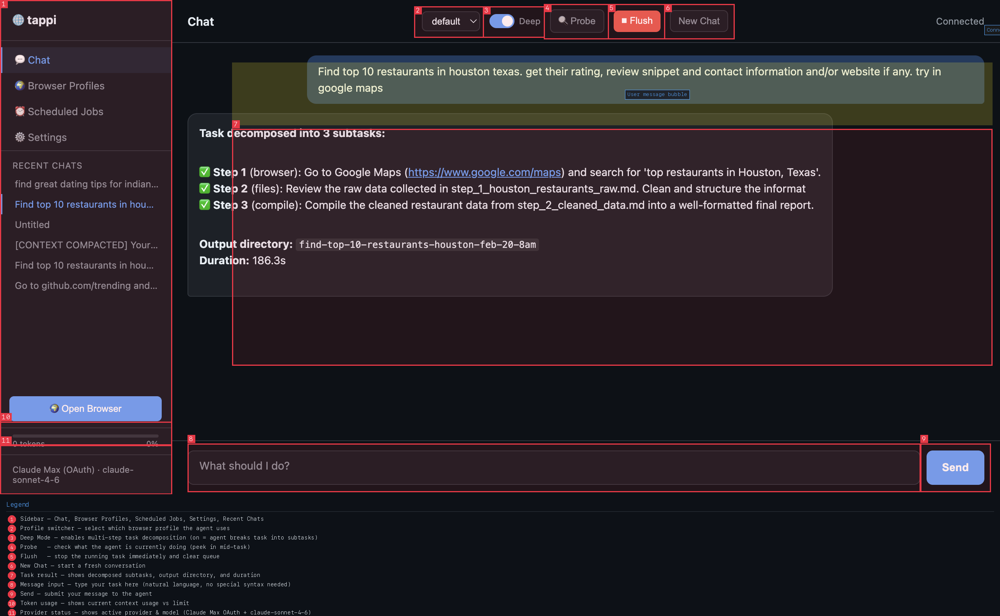
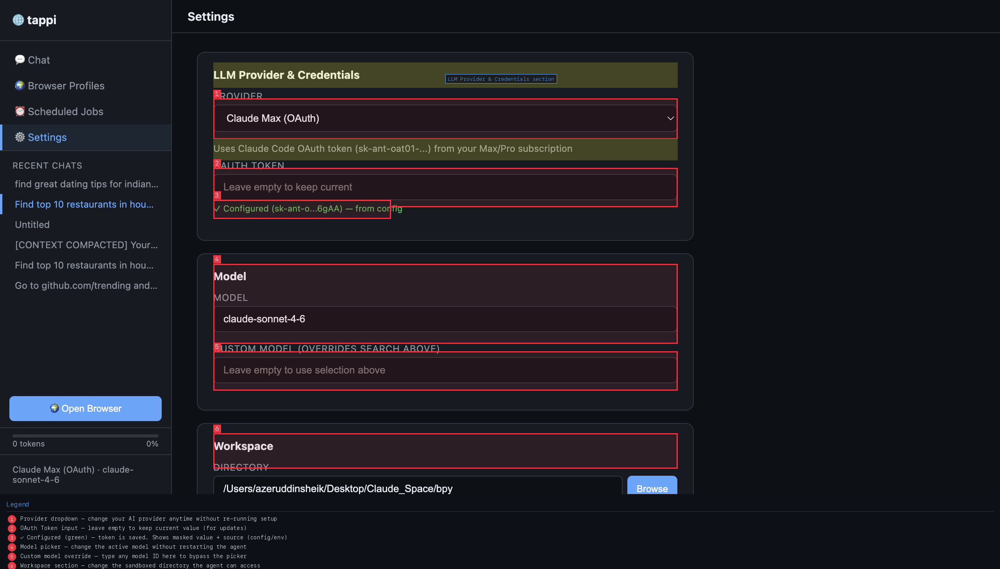
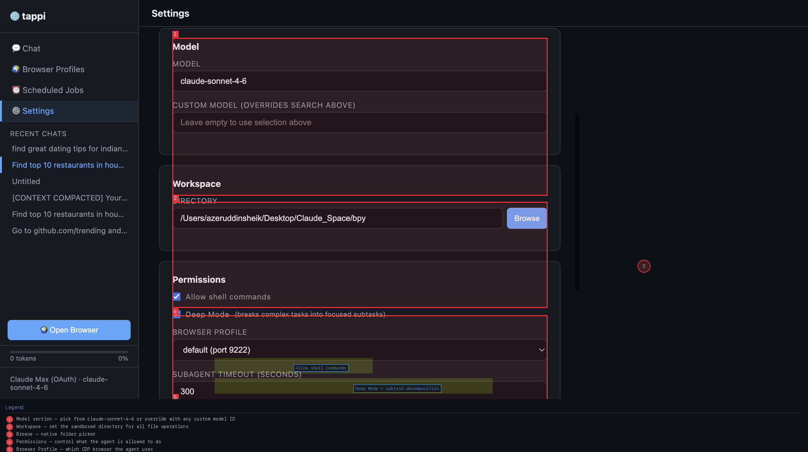

# Tappi Web UI Tutorial — Complete Setup Guide

> From first launch to your first task: a visual walkthrough of every screen in the Tappi web interface.


> **Welcome!** This guide walks you through the Tappi web interface from first launch to running your first task. Tappi is a browser-native AI agent that can browse the web, read and write files, run shell commands, and chain multi-step tasks — all controlled through a clean web UI.

---

## Table of Contents

1. [Part 1: Setup Wizard — Claude Max / Pro (OAuth)](#part-1-setup-wizard--claude-max--pro-oauth)
   - [Step 1: Choose Your Provider](#step-1-choose-your-provider)
   - [Step 2: Select a Model](#step-2-select-a-model)
   - [Step 3: Set Your Workspace](#step-3-set-your-workspace)
   - [Step 4: Browser Profile](#step-4-browser-profile)
   - [Step 5: Log In to Your Accounts](#step-5-log-in-to-your-accounts)
   - [Step 6: Permissions & Launch](#step-6-permissions--launch)
2. [Part 2: Setup Wizard — AWS Bedrock Path](#part-2-setup-wizard--aws-bedrock-path)
3. [Part 3: The Chat Interface](#part-3-the-chat-interface)
4. [Part 4: Settings Page](#part-4-settings-page)

---

## Part 1: Setup Wizard — Claude Max / Pro (OAuth)

The first time you open Tappi, you'll land on the **Setup Wizard**. It walks you through 6 steps to configure your AI provider, model, workspace, and browser. No YAML, no terminal config — it's all in the UI.

> **Tip:** You can always come back and change any of these settings later from the ⚙️ Settings page in the sidebar.

---

### Step 1: Choose Your Provider



The wizard opens on **Step 1: LLM Provider & API Key**. Here's what you're looking at:

| # | Element | What it does |
|---|---------|--------------|
| ① | **Sidebar** | Navigate between Chat, Browser Profiles, Scheduled Jobs, and Settings at any time |
| ② | **Welcome banner** | Confirms the setup wizard auto-launched because no config exists yet |
| ③ | **Progress bar** | 6-segment bar — one segment per setup step, fills as you advance |
| ④ | **Provider dropdown** | Choose your LLM backend here |
| ⑤ | **Next →** | Proceed to the next step (disabled until a provider is selected) |

---

### Selecting Claude Max (OAuth)



Open the **Provider** dropdown and choose **Claude Max (OAuth) ⭐ no API cost**.

> ⭐ **Why "no API cost"?** Claude Max uses your existing Claude Max or Claude Pro subscription via an OAuth token — the same mechanism that powers Claude Code CLI. No separate API key billing. If you already pay for Claude Max/Pro, this provider costs you nothing extra.

After selecting it, a new field appears:

- **OAuth Token** — paste your `sk-ant-oat01-...` token here. You can get this from running `claude` in your terminal (Claude Code) and copying the token from `~/.claude/.credentials.json`, or by following Anthropic's OAuth flow.

Leave the token field empty if you haven't set one up yet — you can fill it in from Settings later.

Click **Next →** when ready.

---

### Step 2: Select a Model



Step 2 lets you pick which Claude model the agent will use.

| Element | What it does |
|---------|--------------|
| **Tool-use filter checkbox** | When checked (default), only shows models that support function/tool calling — required for agent tasks |
| **Model search field** | Start typing to filter the list, or pick from the dropdown. Pre-filled with `claude-sonnet-4-6` |
| **Custom model name** | Override field — type any model ID here to bypass the picker entirely (useful for beta/preview models) |

**Recommended starting model:** `claude-sonnet-4-6` — great balance of speed and capability for agent workloads.

Click **Next →** to continue.

---

### Step 3: Set Your Workspace



The **workspace** is the root directory where the agent can read and write files. Think of it as a sandbox: the agent can't touch anything outside this folder.

| Element | What it does |
|---------|--------------|
| **Path input** | Type a directory path directly (defaults to `~/tappi-workspace`) |
| **Browse button** | Opens a native folder picker to choose graphically |

> 🔒 **Security note:** All file operations are confined to this directory. The agent cannot read your home folder, SSH keys, or anything outside the workspace — it's a hard boundary enforced by the server.

A good choice is a dedicated project folder or `~/tappi-workspace` (created automatically if it doesn't exist).

Click **Next →** when done.

---

### Step 4: Browser Profile



Tappi controls a real Chrome/Chromium browser via the Chrome DevTools Protocol (CDP). Each **browser profile** is an isolated browser instance with its own cookies, logins, and session state.

| Element | What it does |
|---------|--------------|
| **Profile selector dropdown** | Choose an existing profile (e.g., `default (port 9222)`) |
| **New profile name field** | Type a name for a fresh, empty browser profile |
| **Create button** | Launches a new CDP browser on the next available port |

> 💡 **Why multiple profiles?** You can have a `work` profile (logged into GitHub, Jira, Slack) and a `personal` profile (logged into Gmail, Reddit) and switch between them per task — keeping cookies and sessions completely separate.

For first setup, the `default` profile is fine. You can create more from the **Browser Profiles** sidebar page later.

> ⚠️ **Important:** If you type a new profile name, you **must click the Create button** before clicking Next. The wizard won't create the profile for you automatically — if you skip Create and just hit Next, the profile won't exist and browser setup won't work. *(This is a known UX gap — ideally the wizard should block progression until the profile is created or make creation implicit.)*

Click **Next →** to continue.

---

### Step 5: Log In to Your Accounts



Before the agent can interact with sites on your behalf, you need to log in with the browser. This step gives you the chance to do that during setup.

| Element | What it does |
|---------|--------------|
| **Open Browser button** (center) | Launches the browser profile you just configured so you can log in |
| **Open Browser button** (sidebar) | Available any time to open/manage browser sessions after setup |

Click **Open Browser**, then log into Gmail, GitHub, LinkedIn, or any other sites you want the agent to access. Your sessions are saved to the profile — the agent inherits them automatically.

> This step is **completely optional**. Skip it now and come back any time from the sidebar.

Click **Next →** when ready.

---

### Step 6: Permissions & Launch



The final step controls what the agent is **allowed to do**.

| Element | What it does |
|---------|--------------|
| **Allow shell commands** checkbox | Enables the agent to run bash commands, Python scripts, etc. on your machine |
| **← Back** | Return to the previous step |
| **Save & Start** | Saves your configuration and launches the agent — you'll land on the Chat page |

> ⚠️ **Shell commands:** Enabling this gives the agent real terminal access within your workspace. For most development tasks (running tests, installing packages, processing files) you'll want this on. If you're running Tappi in a shared or sensitive environment, leave it off.

Click **Save & Start** to launch Tappi! 🎉

---

## Part 2: Setup Wizard — AWS Bedrock Path

If you use AWS Bedrock (Anthropic Claude models via your AWS account), select **AWS Bedrock** from the provider dropdown on Step 1.


The form expands to show four credential fields. Notice that each field label shows the corresponding **environment variable** right inline — so you know exactly what to set:

| Field | Description | Env vars (shown in label) |
|-------|-------------|--------------------------|
| **AWS ACCESS KEY ID** | Your AWS IAM Access Key | `$AWS_ACCESS_KEY_ID` |
| **AWS SECRET ACCESS KEY** | Your IAM Secret Key | `$AWS_SECRET_ACCESS_KEY` |
| **AWS REGION** | Bedrock region (default: `us-east-1`) | `$AWS_DEFAULT_REGION` / `$AWS_REGION_NAME` / `$AWS_REGION` |
| **AWS PROFILE (OPTIONAL)** | Named AWS CLI profile (default: `default`) | `$AWS_PROFILE` |

### Status Indicators

Each field shows a status line below it:
- **"Not set — provide below or set $ENV_VAR"** — nothing found; the hint tells you exactly which env var to set
- **"✓ Configured (AKIA...XYZ) — from env"** (green) — detected from an environment variable
- **"✓ Configured (AKIA...XYZ) — from config"** (green) — found in `~/.tappi/config.json`

### How Credential Detection Works


Tappi resolves credentials from multiple sources in priority order:
1. **What you type in the field** (highest priority)
2. **Environment variables** — each field shows its env var right in the label (e.g., `ENV: $AWS_ACCESS_KEY_ID`)
3. **CLI credentials files** — `~/.aws/credentials`, `~/.aws/config`, boto3 credential chain

If a credential is found, the status below the field turns green: **"✓ Configured (AKIA...XYZ) — from env"** (or "from config"). If nothing is found, it shows **"Not set — provide below or set $AWS_ACCESS_KEY_ID"** with a direct hint about which env var to set.

### The 🔄 Check Credentials Button

At the bottom of the credential form, you'll see a **⚡ Resolution** box explaining the detection chain, and a **🔄 Check Credentials** button. Click this to:

- Re-scan all environment variables
- Re-read `~/.aws/credentials` and `~/.aws/config`
- Run the full boto3/gcloud/az credential chain resolution

This is especially useful if you just ran `aws configure`, `aws sso login`, or `gcloud auth` — click the button and the status indicators update instantly without reloading the page.

> 💡 **Google Vertex AI** works the same way — auto-detects from `gcloud auth application-default login` and `$GOOGLE_APPLICATION_CREDENTIALS`. Same Check Credentials button, same resolution chain.

After filling in (or confirming) your credentials, click **Next →** to continue through the same model, workspace, and profile steps described in Part 1.

---

## Part 3: The Chat Interface

After completing setup (or on subsequent launches), you land on the **Chat** page — the main control center.



Here's a tour of every control:

### Sidebar (left panel)

| Element | Purpose |
|---------|---------|
| **💬 Chat** | The chat interface (current page) |
| **🌍 Browser Profiles** | Manage CDP browser instances and create new profiles |
| **⏰ Scheduled Jobs** | Set up recurring or time-triggered tasks |
| **⚙️ Settings** | Change provider, model, workspace, and permissions |
| **Recent Chats** | Click any past task to reopen its conversation and results |
| **Token usage bar** | Shows how much of the context window is used (bottom of sidebar) |
| **Provider status badge** | Shows active provider + model (e.g., "Claude Max (OAuth) · claude-sonnet-4-6") |

### Top Bar (toolbar)

| Element | Purpose |
|---------|---------|
| **Profile switcher** (e.g., "default") | Switch which browser profile the agent uses for this session |
| **Deep toggle** | Enables **Deep Mode** — the agent decomposes complex tasks into focused subtasks and runs them in sequence. Great for multi-step research or automation. |
| **🔍 Probe** | Check what the agent is currently doing mid-task — useful for monitoring long-running tasks |
| **⏹ Flush** | Immediately stop the running task and clear the queue (the Flush button turns orange/red when a task is running) |
| **New Chat** | Start a fresh conversation (new chat ID, empty context) |
| **Connected** indicator | Shows the WebSocket connection status to the Tappi server |

### Message Input (bottom)

| Element | Purpose |
|---------|---------|
| **Message input** | Type your task in plain natural language — no special syntax needed |
| **Send button** | Submit the message to the agent |

### Sending Your First Task

Just type what you want in the message box and hit Send:

```
Find the top 10 restaurants in my city and compile their ratings, reviews, and contact info
```

With **Deep Mode on**, the agent will:
1. Decompose the task into subtasks (e.g., "search Google Maps", "extract data", "format report")
2. Run each subtask sequentially
3. Save output files to your workspace
4. Show the final result in the chat

---

## Part 4: Settings Page

Navigate to **⚙️ Settings** in the sidebar to modify your configuration at any time — no need to re-run the setup wizard.

### Provider & Credentials



The top section shows your **LLM Provider & Credentials**:

| Element | What it shows |
|---------|---------------|
| **Provider dropdown** | Switch providers on the fly (e.g., from Claude Max to OpenRouter) |
| **Provider hint** | Explains what credentials this provider needs |
| **Token/Key field** | Update credentials. Leave empty to keep the current saved value |
| **Status indicator** | Green **"✓ Configured (sk-ant-...)"** = credential is saved and active. Shows masked value + source (config vs env var) |

Below that, the **Model** section lets you:
- Change the active model via the search/picker field
- Override with any custom model ID (useful for preview or fine-tuned models)

### Workspace & Permissions



Scrolling down reveals:

| Section | Key setting |
|---------|-------------|
| **Workspace** | Change the sandboxed directory. Browse to pick a new folder |
| **Permissions → Allow shell commands** | Toggle bash/terminal access on/off |
| **Permissions → Deep Mode** | Enable/disable task decomposition globally |
| **Browser Profile** | Switch which CDP browser the agent uses |

### Advanced Settings


Further down are power-user controls:

| Setting | Default | Effect |
|---------|---------|--------|
| **Subagent Timeout (seconds)** | 300 | Max time per LLM call. Orphaned threads are killed after this — prevents runaway tasks |
| **Main Agent Max Tokens** | 8192 | Output token budget for the orchestrator (chat responses + Deep Mode compiler) |
| **Subagent Max Tokens** | 4096 | Output budget for research sub-agents. Lower = faster and more focused; raise if sub-agents are getting cut off |

### Saving Changes

Click the **Save Settings** button (blue, at the bottom of the page) to write all changes to `~/.tappi/config.json`. Changes take effect immediately — no restart needed.

---

## Quick Reference

### Providers at a Glance

| Provider | Authentication | Cost Model |
|----------|---------------|------------|
| **Claude Max (OAuth) ⭐** | OAuth token from your Max/Pro subscription | Included in subscription |
| **Anthropic** | API key from console.anthropic.com | Pay-per-token |
| **OpenRouter** | API key from openrouter.ai | Pay-per-token (aggregated) |
| **OpenAI** | API key from platform.openai.com | Pay-per-token |
| **AWS Bedrock** | AWS credentials (IAM or env vars) | AWS billing |
| **Azure OpenAI** | Azure endpoint + API key | Azure billing |
| **Google Vertex AI** | GCP service account / ADC | GCP billing |

### Keyboard Shortcuts & Tips

- **Send a message:** Press `Enter` in the message input (or click Send)
- **Stop a task:** Click **⏹ Flush** — safe to click even if nothing is running
- **Check progress:** Click **🔍 Probe** mid-task to get a live status snapshot
- **Switch browsers:** Use the profile dropdown in the top bar — takes effect on the next message
- **Reopen past tasks:** Click any item in **Recent Chats** in the sidebar

---

## What's Next?

- 📁 **Explore your workspace** — after a task completes, the output files are in your workspace directory, organized by task name and timestamp
- ⏰ **Schedule recurring tasks** — visit **Scheduled Jobs** to set up cron-style automation ("check my email every morning")
- 🌍 **Manage browser sessions** — visit **Browser Profiles** to add logins, create new isolated profiles, or see which ports each profile is running on
- 🔧 **Tune performance** — if sub-agents are timing out or getting cut off, bump the timeout and max token settings in ⚙️ Settings

Happy tasking! 🚀
